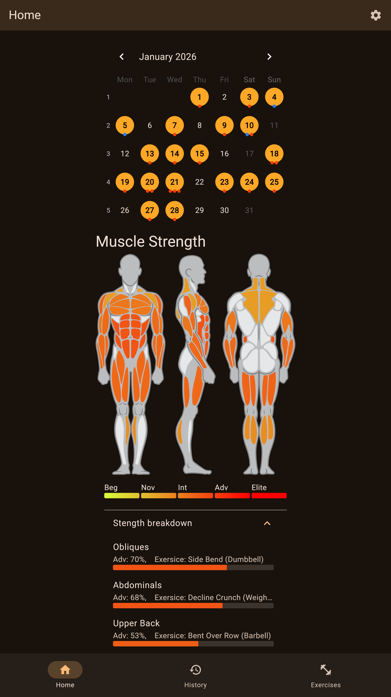
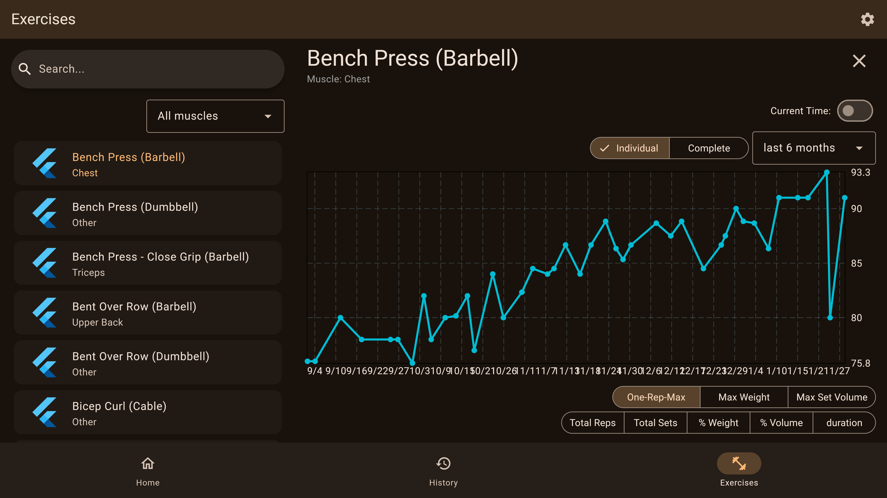

# Workout Analyzer
work in progress

https://workout-analyzer.pages.dev/

<table style="width:100%; border-collapse:collapse;">
  <tr>
    <td style="padding:1px;">
      
    </td>
    <td style="padding:1px;">
      
    </td>
  </tr>
</table>